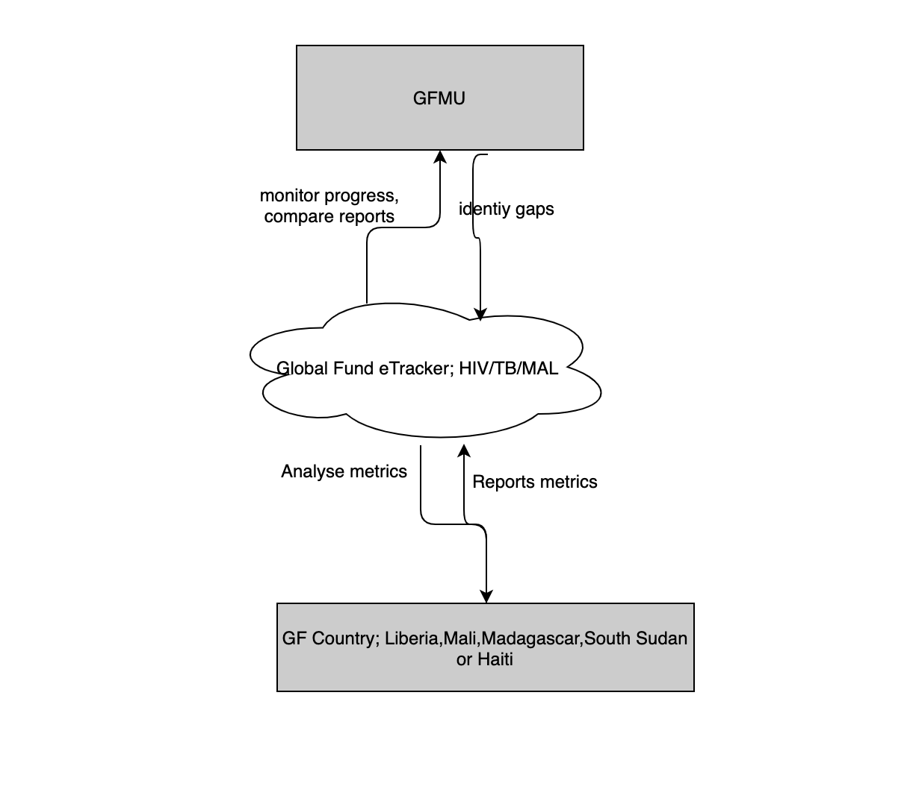

# Overall Description {#intro}

## Global Fund eTracker Perspective

Global Fund eTracker reports information from the following programs;

-	HIV/AIDs: This includes the following modules; Comprehensive prevention program for different targets groups and PMTCT. 
-	Tuberculosis: Includes TB care and prevention, TB / HIV, MDR-TB and Treatment Care Support programs.
-	Malaria: Includes Vector Control, HSS – Procurement and Supply Chain Management, Case management, Health Community Work Force, Specific Prevention Interventions (SPIs).

> Health Information Systems & M&E cut across all the three health areas.

Data is collected in modules within the Global Fund programs through country-specific reporting tools, and then harmonized in a central database for processing and decision making by GFMU.


```{r nice-fig, fig.cap='Global Fund eTracker Information Flow', out.width='80%', fig.asp=.75, fig.align='center', echo=FALSE}

```

## Function specification

Global Fund eTracker features are described below; 


