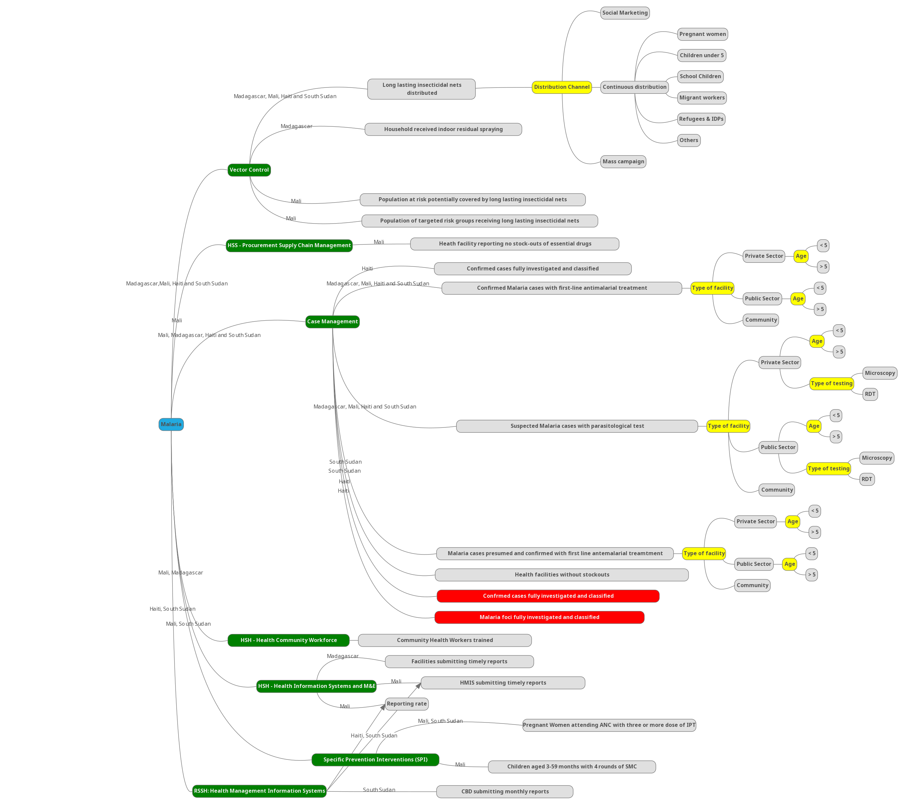

# Data Specification

## Metadata Types

Metadata are helpful to organize the different types of information collected by the Global Fund Management Unit. While other metadata may be included based on a country reporting need, the Global Fund eTracker implements the following metadata types. 

```{r nice-tab, fig.cap='Global Fund eTracker blueprint', out.width='80%', fig.asp=.75, fig.align='center' , echo=FALSE}

metadata_types <- data.frame(`Metadata` = c("Data elements","Date element groups","Data sets",
                                                 "Sections","Category combos","Periods"),
                             `Description` = c("<h3>Description</h3></p>Data elements forms the basis of the Global Fund eTracker. They define what is recorded in the system.</p></p>GF eTracker data elements follows PSI DHIS2 standards for names and short names & the GF Indicator matrix for the form names.</p><p>For instance: <em>GF HIV/AIDS - Estimated MSMs</em> is a data element that records the estimated number of MSMs in a region.</p>
",
"<h3>Description</h3><p>Data element groups provides a mechanism for classifying Global Fund related data elements into a common theme.</p></p>For instance: <em>GF Malaria</em> groups together all GF Malaria data elements.</p>",
"<h3>Description</h3></p>Data reporting in the Global Fund eTracker is organized through the use of the use of data sets.</p><p> A data set is a collection of data elements grouped together for data collection.</p><p> For instance: <em>GF HT - HIV/AIDs</em> is used to report data from HIV/AIDs program in Haiti (HT).</p>
",
"<h3>Description</h3><p>Section are used to split the Global Fund eTracker data sets into small reportable chunks known as modules.</p> <p>They allow for a bit more flexibility when it comes to using the tabular forms in DHIS2 and are quick and simple to design.</p><p> For instance: <em>Comprehensive prevention program for MSMs</em> is a section within the GF HT – HIV/AIDs data set that groups together indicators to form a module <em>Comprehensive prevention program</em> used in the GF HIV programs.</p>",
"<h3>Description</h3><p>Category combos are used to apply Global Fund disaggregation onto the data elements and indicators.They allow multiple categories to be combined into a related set.</p><p> For instance: <em>Number of TB cases with Rifampicin-resistant (RR-TB) and/or MDR-TB notified</em> is disaggregated according to the following categories; <em>Sex (Female, Male) & Age (<15; 15+)</em>
",
"<h3>Description</h3><p>Global Fund eTracker supports DHIS2 standard period types to report and analyze performance over time.</p><p> For instance: <em>201901</em> to report on January of 2019 or <em>2019Sn1</em> to report on the first semester of year 2019. </p>
"),
stringsAsFactors = F)
library(kableExtra)
kable(metadata_types, caption = "A description of Global Fund eTracker Metadata Types", escape = F) %>% kable_styling()

```

## Standards

Global Fund eTracker leverages PSI DHIS2 standards in metadata configurations and follows the principles for digital technology as the leading standard.  

### PSI DHIS2 Standards

Similar to the Health Service Report (HSR), data elements are shared and can be re-used across countries. Unlike HSR, Global Fund eTracker implements country-specific data sets and uses the default sections to display forms on the data entry screen.


### Global Fund Indicator Framework

The Global Fund Indicator Framework guides the reporting and data requirements for the Global Fund eTracker. Countries may have their own specific data or disaggregtions requirements, therefore, the Global Fund eTracker implements country specific reporting tools 


#### HIV/TB Blueprint

```{r nice-fig2, fig.cap='Global Fund eTracker blueprint', out.width='80%', fig.asp=.75, fig.align='center', echo=FALSE}
knitr::include_graphics("./images/gfmublueprint.png")
```


#### Malaria Blueprint

```{r nice-fig3, fig.cap='Global Fund eTracker blueprint', out.width='80%', fig.asp=.75, fig.align='center', echo=FALSE}

```
